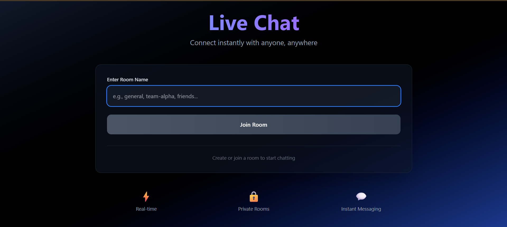
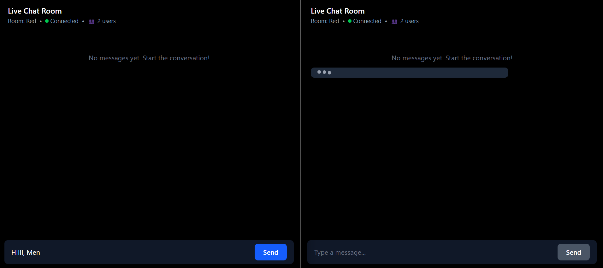

# Live Chat App

A real-time chat application built with WebSocket, React, TypeScript, and Tailwind CSS.



## Features

- 💬 **Real-time messaging** - Instant message delivery using WebSocket
- 🚪 **Room-based chat** - Create or join rooms to chat with specific groups
- 👥 **User count** - See how many users are in the room
- ✍️ **Typing indicators** - Know when someone is typing
- 🎨 **Modern UI** - Beautiful gradient design with smooth animations
- ⚡ **Lightweight** - Minimal dependencies, fast performance

### Typing Feature in Action



## Tech Stack

**Frontend:**

- React 18
- TypeScript
- Tailwind CSS
- WebSocket API

**Backend:**

- Node.js
- WebSocket (ws library)
- TypeScript

## Getting Started

### Prerequisites

- Node.js (v20+)
- npm

### Installation

1. Clone the repository

```bash
git clone https://github.com/bluecoder1080/ChatApp.git
cd ChatApp
```

2. Install backend dependencies

```bash
cd backend
npm install
```

3. Install frontend dependencies

```bash
cd ../frontend
npm install
```

### Running the Application

1. Start the backend server

```bash
cd backend
npm run dev
```

The WebSocket server will start on `ws://localhost:8080`

2. Start the frontend (in a new terminal)

```bash
cd frontend
npm run dev
```

The app will open at `http://localhost:5173`

## Usage

1. Open the application in your browser
2. Enter a room name (e.g., "general", "team-chat")
3. Click "Join Room"
4. Start chatting!

**Tip:** Open multiple browser tabs with the same room name to test multi-user chat.

## Project Structure

```
Chat-App(SocketIo)/
├── backend/
│   ├── src/
│   │   └── index.ts          # WebSocket server
│   ├── package.json
│   └── tsconfig.json
├── frontend/
│   ├── src/
│   │   ├── components/
│   │   │   ├── ChatHeader.tsx
│   │   │   ├── MessageList.tsx
│   │   │   └── MessageInput.tsx
│   │   ├── App.tsx           # Main component
│   │   ├── App.css
│   │   └── main.tsx
│   ├── package.json
│   └── vite.config.ts
└── README.md
```

## Features Breakdown

### WebSocket Events

- `join` - User joins a room
- `chat` - User sends a message
- `typing` - User typing status
- `userCount` - Broadcast current user count

### Components

- **App.tsx** - Main application logic and state management
- **ChatHeader** - Shows room info, connection status, and user count
- **MessageList** - Displays messages and typing indicator
- **MessageInput** - Input field with typing detection

## License

MIT

## Author

**Made by Aditya**

Built with ❤️ using React and WebSocket
